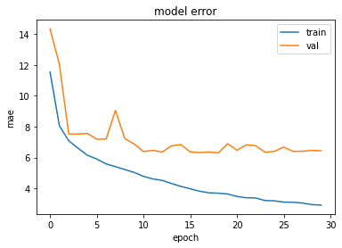
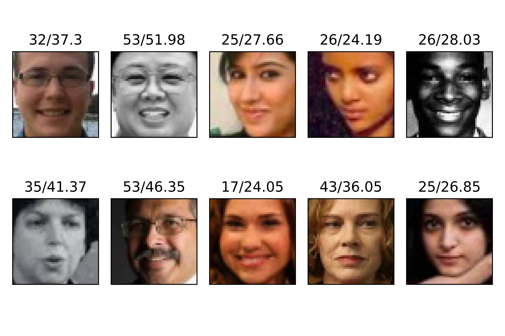
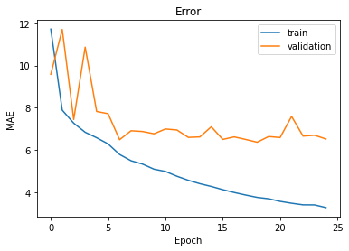
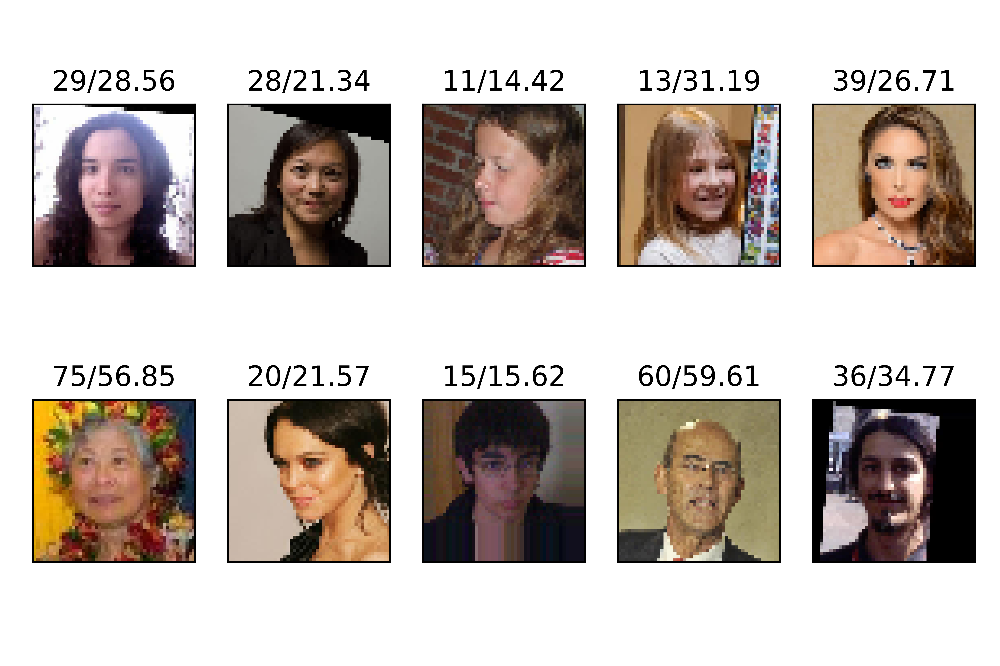

# Age Estimation by a CNN (TensorFlow)

## Introduction
In this project, the aim is to implement a fairly small CNN for the task of age estimation from facial images. The architecture of the implemented Neural Network is based on the architecture proposed in the following paper:<br>
### C. Miron, V. Manta, R. Timofte, A. Pasarica and R. Ciucu, "Efficient convolutional neural network for apparent age prediction," 2019 IEEE 15th International Conference on Intelligent Computer Communication and Processing (ICCP), 2019, pp. 259-262, doi: 10.1109/ICCP48234.2019.8959632.
<br>
However, there is a slight difference. In the mentioned paper, the activation function the output layer, i.e., the Dense layer is Softmax function, whereas in the implemented CNN, the activation function used in the output layer is ReLU.
<br>A summary of this model is given in the following table:

| Layer  | Kernel | Activation | Output Shape
| :------------: |:---------------:|:---------------:|:---------------:|
| **Input** | - | - | 50x50x3
| **Conv2D** | 3x3x32 | ReLU | 48x48x32
| **BN** | - | - | 48x48x32
| **Conv2D** | 3x3x32 | ReLU | 46x46x32
| **BN** | - | - | 46x46x32
| **Conv2D** | 3x3x32 | ReLU | 44x44x32
| **BN** | - | - | 44x44x32
| **Conv2D** | 3x3x32 | ReLU | 42x42x32
| **BN** | - | - | 42x42x32
| **Conv2D** | 3x3x32 | ReLU | 40x40x32
| **BN** | - | - | 40x40x32
| **MaxPooling** | 2x2 | ReLU | 20x20x32
| **Conv2D** | 3x3x32 | ReLU | 18x18x32
| **BN** | - | - | 18x18x32
| **Conv2D** | 3x3x32 | ReLU | 16x16x32
| **BN** | - | - | 16x16x32
| **MaxPooling** | 2x2 | ReLU | 8x8x32
| **Conv2D** | 3x3x32 | ReLU | 6x6x32
| **BN** | - | - | 6x6x32
| **MaxPooling** | 2x2 | ReLU | 3x3x32
| **Conv2D** | 3x3x32 | ReLU | 1x1x32
| **Flatten** | - | - | 32
| **Dense** | - | ReLU | Ages


<br>

Datasets:

[UTKFace](https://susanqq.github.io/UTKFace/)
and
[APPA-REAL](http://158.109.8.102/AppaRealAge/appa-real-release.zip)

Data samples of these datasets are divided into three segments: Train, Validation, and Test
UTKFace contains 23.7k image files. When using this dataset, 15% of the samples are considered as the test data and 5% of the rest is the validation data and the other 19k samples are used as the train data.
APPA-REAL dataset, however, has the sample facial images split into three mentioned segments by default. There are 7.5k images in this dataset in total. Since the number of training instances are low, all the images are merged together and then they are split once again. After this second split, there are 5.8k images for training, 645 for validation, and 1.1k for testing.

## Installation

First, you'll need to clone this repository to your local drive via the following command:

```shell
$ git clone https://github.com/Ali-Jedari/Age_Estimation_CNN.git
$ cd Age_Estimation_CNN
```

Alternatively, if `git` package is not installed, you can download the zip file for this repository and then extract it.

It is originally implemented in Google Colab environmnet (original notebook [here](https://colab.research.google.com/drive/1GTDfkU_g1YEKDk64PTF7t9Rnzl61gct5?usp=sharing))
<br>For convinience, the downloaded notebook (ipynb file) and its python file (py file) are uploaded to this repository.

## Requirements

This project is written in python 3 and requires TensorFlow, Scikit-learn, Pandas, Numpy libraries.

All the required libraries can be installed by running the following command:

```shell
$ pip install -r requirements.txt
```

If the command above results in an error, you can also try:

```shell
$ python -m pip install -r requirements.txt
```
Also, the datasets should be downloaded on your computer.
## Usage
The dataset name should be specified when running the py file. Valid dataset names are APPA (or APPA-REAL) and UTK (or UTKFace) 

case insensitive!

Also, the path to the dataset's folder should be specified, too. Otherwise, the dataset is considered to be in the same directory as the python file.

Run:

```shell
$ python Age_Estimation_CNN.py [dataset] [path]
```

For example:

```shell
$ python Age_Estimation_CNN.py utk path/to/UTKFace
```
## Results
When using the UTKFace dataset, this model obtains an MAE of 2.9138 on the training set, 6.4351 on the validation set, and 6.3890 on the test set.

The following depicts the MAE-Epoch graph of this model when using the UTKFace dataset:



The following figure shows an example of this model's results on ten randomly chosen images from UTKFace:



When using the APPA-REAL dataset, this model obtains an MAE of 3.0292 on the training set, 10.0869 on the validation set, and 10.0648 on the test set.

The following depicts the MAE-Epoch graph of this model when using the UTKFace dataset:



The following figure shows an example of this model's results on ten randomly chosen images from UTKFace:

